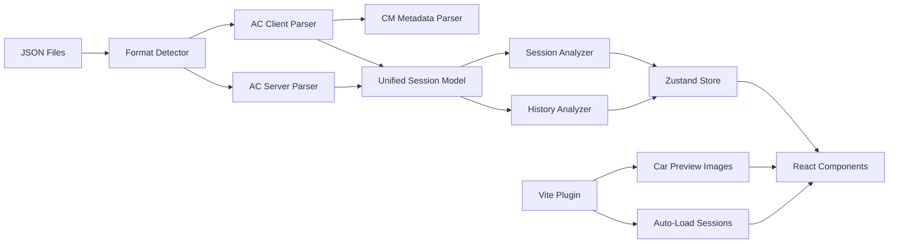

<div align="center">

# 🏁 AC Results Analyzer

### *Analiza tus carreras de Assetto Corsa como un profesional*

[](https://www.typescriptlang.org/)
[](https://react.dev/)
[](https://vitejs.dev/)
[](LICENSE)
[](https://www.assettocorsa.net/)

---

**AC Results Analyzer** es una aplicación web moderna que lee y visualiza los resultados de sesiones de **Assetto Corsa** con gráficas ricas, tablas de telemetría y análisis inteligente de rendimiento. Compatible con archivos de **Content Manager**, servidor AC y cliente AC.

[🚀 Inicio Rápido](#-inicio-rápido) •
[📊 Funcionalidades](#-funcionalidades) •
[🎨 Temas](#-temas-de-marca) •
[🏗️ Arquitectura](#️-arquitectura) •
[📦 Tech Stack](#-tech-stack)

</div>

---

## ✨ Highlights

| Feature | Descripción |
|---------|-------------|
| 🔄 **Auto-detección** | Encuentra automáticamente las carpetas de Content Manager y Assetto Corsa |
| 🖼️ **Imágenes de autos** | Carga las preview.jpg directamente del install de AC |
| 📊 **6+ tipos de gráficas** | Tiempos, posiciones, brechas, sectores, neumáticos, estado |
| 📋 **Telemetría detallada** | Desglose vuelta por vuelta con sectores coloreados |
| 🧠 **Análisis inteligente** | Vuelta teórica ideal, consistencia, degradación, sector débil |
| 🎨 **4 temas de marca** | Ferrari 🔴, Porsche 🟤, Toyota 🔵, Ford 🔵🟠 |
| 📁 **Múltiples formatos** | JSON de CM, servidor AC, cliente AC + archivos ZIP |
| 🌐 **Interfaz en español** | UI completamente en español |

---

## 🚀 Inicio Rápido

### Prerrequisitos

- [Node.js](https://nodejs.org/) 18+
- [pnpm](https://pnpm.io/) (recomendado) o npm

### Instalación

```bash
# Clonar el repositorio
git clone https://github.com/TU_USUARIO/RDev.App.AssettoCorsaResultsAnalizer.git
cd RDev.App.AssettoCorsaResultsAnalizer

# Instalar dependencias
pnpm install

# Iniciar servidor de desarrollo
pnpm dev
```

### ¡Listo! 🎉

Abre **http://localhost:5173** y la aplicación:

1. ✅ **Auto-detecta** tu carpeta de Content Manager
2. ✅ **Auto-detecta** tu instalación de Assetto Corsa
3. ✅ **Carga todas las sesiones** automáticamente
4. ✅ **Muestra imágenes de autos** desde tus archivos locales

> **Nota:** Si AC o CM no están instalados en las rutas por defecto, puedes arrastrar archivos JSON manualmente.

---

## 📊 Funcionalidades

### 🏆 Panel de Sesión

Cada sesión muestra un dashboard completo con **todas las gráficas en una sola vista scrolleable**:

| Componente | Qué muestra |
|------------|-------------|
| **Tabla de clasificación** | Posición, piloto, auto (con preview), mejor vuelta, brecha, ritmo |
| **Estado de finalización** | Donut animada: finalizados, DNF, DQ |
| **Estrategia de neumáticos** | Timeline horizontal de stints por piloto |
| **Evolución de tiempos** | Gráfica multi-línea de tiempos por vuelta |
| **Posiciones por vuelta** | Bump chart con eje Y invertido |
| **Brecha al líder** | Área chart con gradientes |
| **Comparación de sectores** | Barras agrupadas S1/S2/S3 |

### 📋 Tabla de Telemetría

Desglose vuelta por vuelta para cada piloto con sectores **coloreados por rendimiento**:

| Color | Significado |
|-------|-------------|
| 🟣 Púrpura | Mejor tiempo de la sesión |
| 🟢 Verde | Mejor personal (PB) |
| 🟡 Amarillo | Cerca del PB (±2%) |
| 🔴 Rojo | Significativamente más lento |

Incluye: delta al mejor, delta al promedio, neumático, cortes, validez y tiempo acumulado.

### 🧠 Análisis de Rendimiento

Insights automáticos generados desde los datos:

- 🏆 **Mejor vuelta** — quién, cuándo, con qué sectores
- ⚡ **Vuelta teórica ideal** — combinando los mejores sectores de todos los pilotos
- 🎯 **Consistencia** — piloto más y menos consistente (desviación estándar)
- 📈 **Evolución del ritmo** — mejora o degradación a lo largo de la sesión
- 📉 **Sector débil** — dónde pierde más tiempo cada piloto
- 🏁 **Brecha del ganador** — análisis de la ventaja final
- ⚠️ **Cortes de pista** — total y por piloto
- 🌡️ **Condiciones** — impacto del clima y temperatura

### 📈 Historial Multi-Sesión

Vista agregada de todas las sesiones cargadas:

- 🏟️ Frecuencia de tracks
- 🚗 Autos más usados
- 📊 Tendencia de rendimiento a lo largo del tiempo

---

## 🎨 Temas de Marca

Cambia el tema con un clic desde el header. Cada tema adapta **colores, gradientes, sombras y fondos**:

| Tema | Paleta | Inspiración |
|------|--------|-------------|
| 🔴 **Ferrari** | Rojo rosso corsa + oro | Scuderia Ferrari F1 |
| 🟤 **Porsche** | Plata + oro viejo | Porsche Motorsport |
| 🔵🔴 **Toyota** | Rojo + azul cielo | Toyota Gazoo Racing WEC |
| 🔵🟠 **Ford** | Azul performance + naranja | Ford GT Le Mans heritage |

El tema seleccionado se **persiste** en `localStorage`.

---

## 🏗️ Arquitectura

```
src/
├── core/
│   ├── models/types.ts          # 15+ interfaces TypeScript
│   ├── parsers/
│   │   ├── format-detector.ts   # Router de formato JSON
│   │   ├── ac-client-parser.ts  # Parser AC cliente/CM
│   │   ├── ac-server-parser.ts  # Parser AC servidor
│   │   └── cm-metadata-parser.ts# Parser INI/JSON metadata CM
│   ├── analyzers/
│   │   ├── session-analyzer.ts  # Stats, sectores, gaps
│   │   └── history-analyzer.ts  # Agregación multi-sesión
│   └── utils/
│       ├── time-formatter.ts    # mm:ss.SSS formatting
│       └── car-name-humanizer.ts# ks_toyota_gt86 → Toyota GT86
├── services/
│   ├── file-loader.ts           # Carga archivos/ZIP/carpetas
│   ├── car-asset-service.ts     # Imágenes de autos vía HTTP
│   └── auto-setup.ts            # Auto-detección de carpetas
├── stores/
│   └── session-store.ts         # Zustand state management
├── components/
│   ├── layout/AppShell.tsx
│   ├── file-input/FileDropZone.tsx
│   ├── session-list/SessionCard.tsx
│   ├── session/
│   │   ├── SessionDashboard.tsx
│   │   ├── StandingsTable.tsx
│   │   ├── TelemetryTable.tsx
│   │   └── DataAnalysis.tsx
│   ├── charts/
│   │   ├── LapTimesChart.tsx
│   │   ├── PositionChart.tsx
│   │   ├── SectorComparisonChart.tsx
│   │   ├── GapToLeaderChart.tsx
│   │   ├── FinishStatusDonut.tsx
│   │   └── TyreStrategyTimeline.tsx
│   ├── driver/DriverDetailView.tsx
│   ├── history/HistoryDashboard.tsx
│   └── shared/
│       ├── CarPreviewImage.tsx
│       ├── ThemePicker.tsx
│       ├── LapTimeSparkline.tsx
│       └── PositionBadge.tsx
├── i18n/es.ts
└── index.css                    # Design system completo
```

### Flujo de Datos



---

## 📦 Tech Stack

| Tecnología | Versión | Uso |
|------------|---------|-----|
| [React](https://react.dev/) | 19 | UI framework |
| [TypeScript](https://www.typescriptlang.org/) | 5.8 | Type safety |
| [Vite](https://vitejs.dev/) | 6 | Build tool + dev server |
| [Zustand](https://zustand.docs.pmnd.rs/) | 5 | State management |
| [Recharts](https://recharts.org/) | 2 | Gráficas y charts |
| [Lucide React](https://lucide.dev/) | 0.514 | Iconos |
| [JSZip](https://stuk.github.io/jszip/) | 3 | Lectura de archivos ZIP |

---

## 📁 Formatos Soportados

| Formato | Origen | Detección |
|---------|--------|-----------|
| **CM Session JSON** | Content Manager → Progress/Sessions | Auto ✅ |
| **AC Client JSON** | Assetto Corsa client export | `players`, `sessions` keys |
| **AC Server JSON** | Servidor dedicado AC | `Cars`, `Result`, `Laps` keys |
| **ZIP** | Cualquier ZIP con JSONs dentro | Manual 📦 |

### Rutas auto-detectadas

```
📁 Content Manager Sessions
   └── %LOCALAPPDATA%\AcTools Content Manager\Progress\Sessions\

📁 Assetto Corsa Install
   └── D:\SteamLibrary\steamapps\common\assettocorsa\
   └── C:\Program Files (x86)\Steam\steamapps\common\assettocorsa\
```

---

## 🤝 Contribuir

¡Las contribuciones son bienvenidas! Por favor:

1. Fork el repositorio
2. Crea una rama para tu feature (`git checkout -b feature/amazing-feature`)
3. Commit tus cambios (`git commit -m 'Add amazing feature'`)
4. Push a la rama (`git push origin feature/amazing-feature`)
5. Abre un Pull Request

---

## 📄 Licencia

Este proyecto está bajo la Licencia MIT — ver el archivo [LICENSE](LICENSE) para detalles.

---

<div align="center">

**Hecho con ❤️ para la comunidad de sim racing**

🏁 *Analiza. Mejora. Gana.* 🏁

</div>
