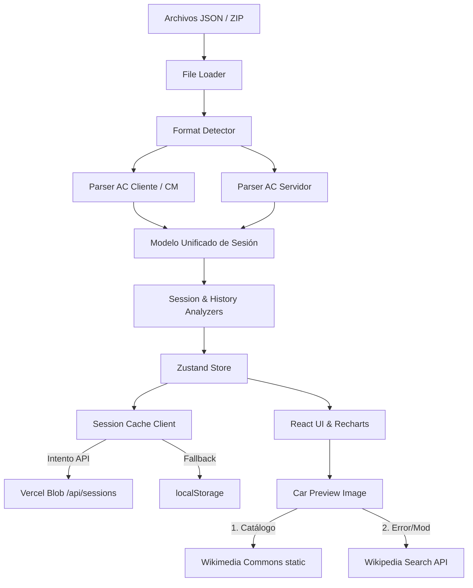

<div align="center">

# 🏁 AC Results Analyzer

### *Analiza tus carreras de Assetto Corsa como un profesional*

[](https://www.typescriptlang.org/)
[](https://react.dev/)
[](https://vitejs.dev/)
[](https://vercel.com/)
[](LICENSE)

---

**AC Results Analyzer** es una aplicación web (React SPA) moderna que lee y visualiza los resultados de sesiones de **Assetto Corsa** con gráficas premium inspiradas en transmisiones de F1, tablas de telemetría detalladas y análisis inteligente de rendimiento.

[🚀 Inicio Rápido](#-inicio-rápido) •
[📊 Funcionalidades](#-funcionalidades) •
[🎨 Temas](#-temas-de-marca) •
[🏗️ Arquitectura](#️-arquitectura) •
[📦 Tech Stack](#-tech-stack)

</div>

---

## ✨ Highlights

| Feature | Descripción |
|---------|-------------|
| 🌐 **Persistencia Compartida** | Guarda los últimos 20 archivos subidos globalmente usando **Vercel Blob** |
| 🔌 **Cache Híbrido** | Cae automáticamente a **localStorage** local si la API remota no está disponible |
| 🖼️ **Buscador de Previews** | Resuelve autos oficiales vía catálogo estático, y autos mods vía **Wikipedia API** |
| 📊 **7 Gráficas Premium** | Visualización motorsport: curvas suaves, gradientes y tooltips oscuros glassmorphic |
| 📋 **Telemetría detallada** | Desglose vuelta por vuelta con sectores coloreados por rendimiento |
| 🧠 **Análisis inteligente** | Vuelta teórica ideal, consistencia, degradación, sector débil y clima |
| 🎨 **4 Temas de Marca** | Ferrari 🔴, Porsche 🟤, Toyota 🔵, Ford 🔵🟠 |
| 📁 **Formatos Flexibles** | JSON de CM, servidor AC, cliente AC + archivos comprimidos ZIP |

---

## 🚀 Inicio Rápido

### Prerrequisitos

- [Node.js](https://nodejs.org/) 20+
- [pnpm](https://pnpm.io/) (instalador recomendado)

### Instalación en Local

```bash
# 1. Clonar el repositorio
git clone https://github.com/TU_USUARIO/RDev.App.AssettoCorsaResultsAnalizer.git
cd RDev.App.AssettoCorsaResultsAnalizer

# 2. Instalar dependencias
pnpm install

# 3. Configurar variables de entorno locales (opcional para Vercel Blob local)
echo 'BLOB_READ_WRITE_TOKEN="tu_token_de_vercel_blob"' > .env.local

# 4. Iniciar servidor de desarrollo
pnpm dev
```

Abre **http://localhost:5173** para cargar archivos arrastrándolos directamente a la interfaz web.

---

## 📊 Funcionalidades

### 🏆 Panel de Sesión

Dashboard completo que agrupa todas las gráficas y análisis clave de la carrera:

- **Tabla de clasificación**: Clasificación oficial con fotos de los vehículos (con popover zoom), mejor vuelta, brechas y estado de finalización (badge).
- **Estado de finalización (Donut)**: Distribución animada de pilotos que terminaron, DNF (no terminaron) o fueron descalificados (DQ) con contador central.
- **Estrategia de neumáticos**: Línea de tiempo que detalla los stints de neumáticos (Compuestos oficiales F1 como Soft 🔴, Medium 🟡, Hard ⚪) por piloto.
- **Evolución de tiempos**: Líneas de tiempo con curvas suaves (`natural`) para identificar la consistencia de ritmo.
- **Posiciones por vuelta**: Gráfica de pasos (`stepAfter`) con el eje Y invertido para rastrear rebases.
- **Brecha al líder**: Área chart con degradados translúcidos por piloto.
- **Comparación de sectores (Barras)**: Sectores S1 (púrpura), S2 (amarillo) y S3 (verde) por piloto con barras redondeadas.

### 📋 Tabla de Telemetría

Desglose vuelta por vuelta coloreado por rendimiento:
- 🟣 **Púrpura**: Mejor sector/vuelta de toda la sesión.
- 🟢 **Verde**: Mejor personal del piloto (PB).
- 🟡 **Amarillo**: Cerca de su PB (dentro de un 2%).
- 🔴 **Rojo**: Sector significativamente lento.

### 🧠 Análisis de Rendimiento (AI / Insights)

Generación automática de conclusiones en base a la telemetría:
- ⚡ **Vuelta teórica ideal**: Suma de los mejores sectores absolutos y delta con la mejor vuelta real.
- 🎯 **Consistencia**: Análisis de regularidad por piloto mediante desviación estándar.
- 📈 **Degradación de ritmo**: Evolución de tiempos iniciales vs finales por stint para identificar pérdida de adherencia.
- 📉 **Sector débil**: Identificación del sector donde cada piloto pierde más tiempo respecto al líder.

---

## 🎨 Temas de Marca

El header incluye un selector para alternar entre 4 estéticas premium que alteran variables globales CSS y colores de gráficas:
- 🔴 **Ferrari**: Rojo rosso corsa + acentos dorados.
- 🟤 **Porsche**: Plata metálico + oro viejo.
- 🔵🔴 **Toyota**: Rojo competición + azul cielo.
- 🔵🟠 **Ford**: Azul performance + naranja Le Mans heritage.

---

## 🏗️ Arquitectura

```
api/                     # Funciones serverless de Vercel
└── sessions.ts          # API REST para Vercel Blob (GET/POST/DELETE) con FIFO (20 archivos)
src/
├── core/                # Lógica pura de negocio (independiente de React)
│   ├── models/types.ts  # Tipados estrictos de telemetría y UI
│   ├── parsers/         # Format Detector, AC Client, AC Server, CM Metadata
│   ├── analyzers/       # Algoritmos de consistencia, gaps, sectores y mejores vueltas
│   └── utils/           # Formateadores de tiempo y humanizador de autos
├── services/            # Servicios I/O
│   ├── file-loader.ts   # Carga y descompresión de archivos ZIP y JSON
│   ├── car-asset-service.ts # Resuelve imágenes de autos catalogados + Wikipedia API
│   └── session-cache.ts # Cliente de caché híbrido (Vercel Blob + localStorage fallback)
├── stores/              # Estado global con Zustand
└── components/          # Componentes visuales y gráficas Recharts F1-style
```

### Flujo de Carga de Datos



---

## 📦 Tech Stack

- **Framework**: [React](https://react.dev/) 19 & [TypeScript](https://www.typescriptlang.org/) 5
- **Build Tool**: [Vite](https://vitejs.dev/) 6
- **Serverless Backend**: [Vercel Functions](https://vercel.com/docs/functions) (`@vercel/node`)
- **Shared Storage**: [Vercel Blob](https://vercel.com/docs/storage/vercel-blob) (`@vercel/blob`)
- **Web Analytics**: [Vercel Web Analytics](https://vercel.com/docs/analytics) (`@vercel/analytics`)
- **Gráficas**: [Recharts](https://recharts.org/) 2 (personalización premium de SVGs, animaciones y grids)
- **Estado**: [Zustand](https://zustand.docs.pmnd.rs/) 5
- **Extracción ZIP**: [JSZip](https://stuk.github.io/jszip/) 3
- **Iconografía**: [Lucide React](https://lucide.dev/)

---

## 📄 Licencia

Este proyecto está bajo la Licencia MIT — ver el archivo [LICENSE](LICENSE) para detalles.
